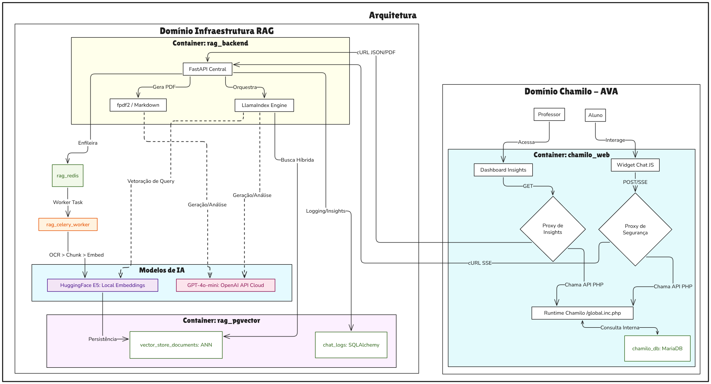
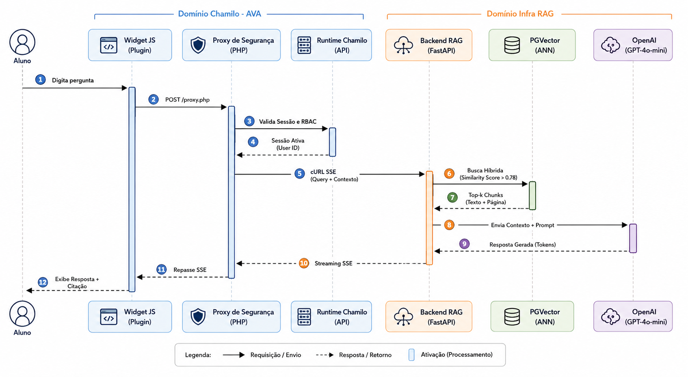
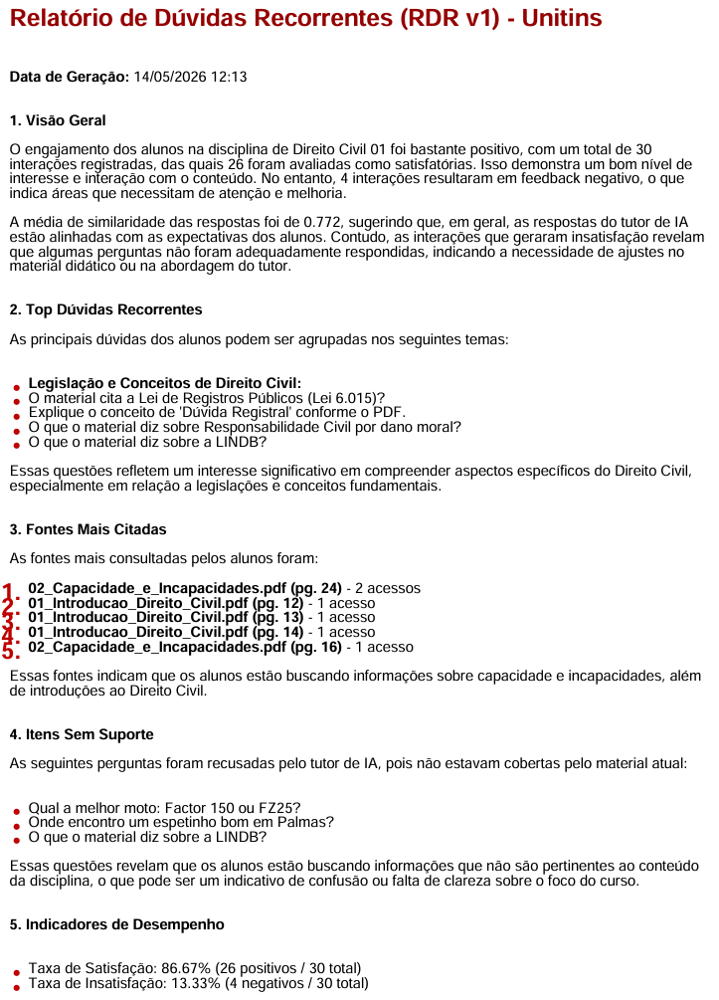

# RAG-based Educational Chatbot Architecture

Este repositório documenta a arquitetura de alto nível de um chatbot educacional de contexto restrito, desenvolvido como projeto de TCC (Unitins, 2026). O foco central é a mitigação de "alucinações" em LLMs e a garantia de proveniência de dados em ambientes acadêmicos.

## 🏗️ Arquitetura do Sistema
O sistema foi estruturado em microsserviços, utilizando um pipeline de RAG (Retrieval-Augmented Generation) para processar e responder a dúvidas acadêmicas com base em documentos verificados.

## 🔄 Fluxo de Processamento (Diagrama de Sequência)
O diagrama abaixo detalha a interação entre a camada de recuperação vetorial, o LLM e o filtro de contexto:

## 🚀 Diferenciais Técnicos
* **Isolamento de Contexto (Multi-tenant):** Implementação de filtros via metadados (lesson_id/course_id) para garantir que o chatbot responda apenas ao conteúdo da disciplina em questão.
* **Filtro LTE (Cadeado Pedagógico):** Estratégia programática para evitar o vazamento de conteúdo futuro (ex: aulas não liberadas pelo professor).
* **Proveniência de Dados:** Integração de metadados de página nos chunks vetoriais, permitindo citar a fonte exata (documento e página) de cada resposta.

## 📊 Analytics e Melhoria Contínua
Implementamos o módulo **MIA (Módulo de Inteligência Analítica)**, que gera o *Relatório de Dúvidas Recorrentes (RDR v1)*. Isso permite que o professor ajuste o plano de ensino com base nas lacunas reais de aprendizado da turma.

*Exemplo de insight gerado pelo sistema:*
 *(Substitua por um print de um trecho do seu relatório)*

## 🛠️ Stack Tecnológica
- **Backend:** Python (FastAPI)
- **Persistência Vetorial:** PostgreSQL + `pgvector`
- **Orquestração:** Docker & Docker Compose
- **Pipeline RAG:** LlamaIndex
- **LLM:** OpenAI GPT-4o-mini (via API)
